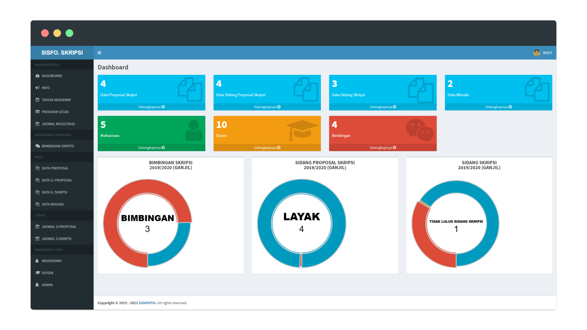

# SISKRIPSI



## Tentang
Sistem Informasi Skripsi untuk memudahkan mahasiswa dalam mendaftar & memanajemen pendaftaran proposal skripsi hingga wisuda. Memudahkan staff Fakultas Teknik dalam mengolah data mahasiswa baik data proposal skripsi - data wisuda dan mengatur jadwal pendaftaran & informasi. Memudahkan Ka.Prodi dalam manajemen dosen pembimbing dan penguji. Serta memudahkan dosen dalam mengakses informasi mahasiswa bimbingannya. 

## Spesifikasi
1. CodeIgniter 3.11
2. AdminLTE
3. Bootsrap
4. DomPDF
5. PHPOffice
6. PHP ver 7.4 - 8.0.11

## Usage
Install Required via Composer pada folder siskrip/admin
open via Terminal atau Command Prompt
```sh
cd siskrip/admin
composer require phpoffice/phpspreadsheet
```

## Changelog
- Update autoload PHPOffice/phpspreadsheet
- Update PHPOffice/phpspreadsheet (1.21.0)
- Fix session error / success notification
- Tahun Akademik -> Aktif

## Bugs
- Set Format Number PHPOffice/phpspreadsheet for report in excel
- Driver session error at PHP ver 8.1.2
